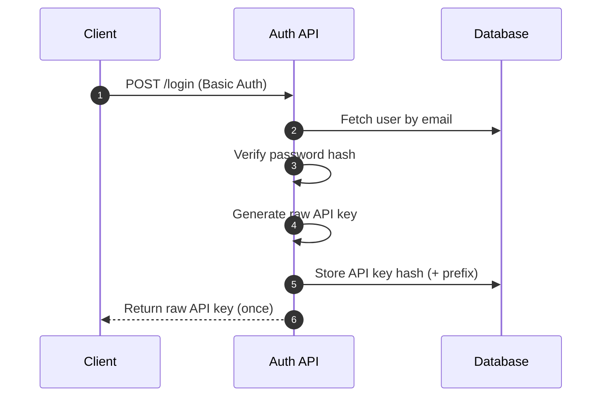
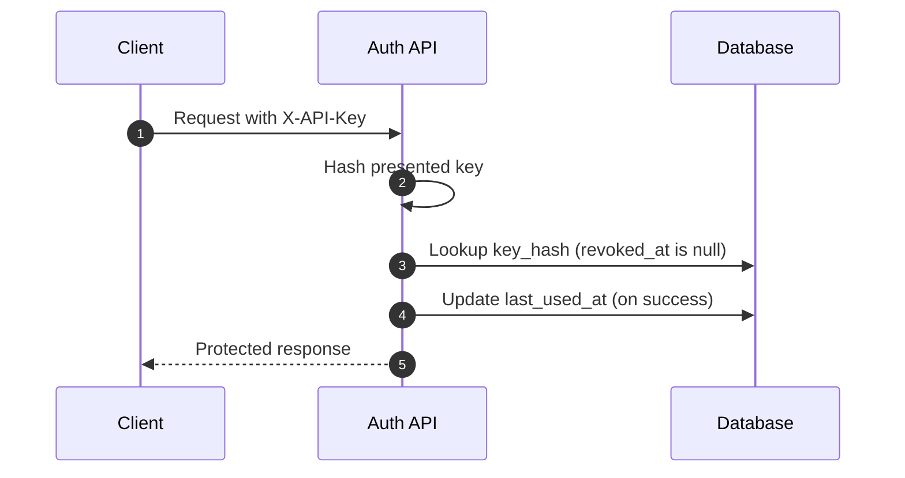

# basic-auth-api — Authn vs Authz Board

## 1) Project goal

Build the simplest possible **real-world** authentication + authorization system to make the boundary clear:

- **Authentication (Authn):** *Who are you?* (prove identity)
- **Authorization (Authz):** *What can you access?* (enforce permissions / limit damage)

---

## 2) Project role in the IAM landscape

This project is a **Service Provider (SP)** only:

- The API authenticates users with **credentials**
- The API authorizes access to protected endpoints using **API keys**
- The API **does not** act as an **Identity Provider (IdP)**

Why: an IdP/SSO product must handle multiple clients, federation, tokens, consent, key rotation, metadata, etc. That is not “minimal”.

---

## 3) In scope

### Authentication (Authn)
- **Single-factor authentication (SFA)**: *knowledge factor* only
- Username + password
- **HTTP Basic Auth** used **only** on `/login`

### Authorization (Authz)
- **API key** as a bearer secret (required for protected endpoints)
- Key revocation
- Usage tracking (`last_used_at`)

### Security fundamentals
- Password hashing (**bcrypt** or **argon2**)
- API key stored only as a **hash** (e.g., SHA-256), never raw
- Constant-time comparisons for secrets
- Proper HTTP status codes
- Redirect HTTP traffic to HTTPS for securing encryptation on credentials

---

## 4) Out of scope (explicit)

- OAuth 2.0
- OpenID Connect (OIDC)
- JWT
- SSO
- SAML
- MFA / 2FA
- Federation
- JAR / PAR

---

## 5) Domain model

### `users`
- `id` (uuid)
- `email` (unique)
- `password_hash`
- `created_at`

### `api_keys`
- `id` (uuid)
- `user_id` (fk)
- `key_hash` (SHA-256)
- `prefix` (first 8 chars of the raw key, for support/logging)
- `created_at`
- `revoked_at` (nullable)
- `last_used_at` (nullable)

**Rules**
- Raw passwords are never stored
- Raw API keys are never stored
- Raw API key is returned **once** at creation time

---

## 6) API endpoints

### Public
- `POST /users` — create user
- `POST /login` — Basic Auth, issues a new API key

### Protected (API key required)
- `GET /me`
- `POST /api-keys/revoke`

---

## 7) Authentication flow (login)

---

## 8) Authorization flow (protected request)

---

## 9) Authorization rules

* Missing API key → **401**
* Invalid API key → **401**
* Revoked API key → **401**
* Valid API key → **request allowed**

---

## 10) Test assertions (minimum useful set)

### Login

* No Basic Auth → **401**
* Wrong password → **401**
* Correct credentials → **200** with non-empty `apiKey`

### Protected endpoints

* No API key → **401**
* Invalid API key → **401**
* Revoked API key → **401**
* Valid API key → **200** and `req.auth.userId` is correct

### Persistence

* `users.email` is unique
* API key stored only as hash (never raw)
* `last_used_at` updates on use (valid key)

---

## 11) Glossary: core IAM concepts

### Authn vs Authz (mental model)

* **Authn** proves identity: *who is calling?*
* **Authz** enforces permissions: *what are they allowed to do?*
* They are complementary: Authn protects **accounts/identity**; Authz protects **systems/resources**

### Authentication factors

* **Knowledge:** password, passphrase
* **Possession:** OTP, token, device
* **Inherence:** biometrics (fingerprint / face)

Terms:

* **SFA:** 1 factor
* **MFA:** 2+ factors
* **2FA:** exactly 2 factors
* **Passwordless:** no knowledge factor (e.g., WebAuthn)
* **Adaptive auth:** risk-based decisions (device, location, behavior)

### Examples of “auth” in the real world

* Fingerprint + PIN
* Showing an ID to open an account
* Browser verifies site identity via TLS certificates
* API keys as shared secrets between systems

### Authorization models

* **RBAC:** role-based access control
* **ABAC:** attribute-based access control
* **MAC:** mandatory access control (centrally enforced policy)
* **DAC:** discretionary access control (resource owner decides)

Examples:

* Email app: user sees only their own mailbox
* Healthcare: patient data restricted to authorized providers

---

## 12) Beyond this project (why OAuth/OIDC/SSO are not “minimal”)

This repo intentionally avoids these, but you should still understand the map:

### OAuth 2.0 (authorization, not authentication)

OAuth’s job is **delegated authorization** (issuing/accessing access tokens). Typical actors/terms:

* Resource Owner, Client, Authorization Server, Resource Server
* Redirect URI (callback), Response Type, Scope, Consent
* Client ID/Secret, Authorization Code, Access Token

### OIDC (authentication layer on top of OAuth 2.0)

OIDC adds identity (*who the user is*) via an **ID Token**.

* Uses discovery (`.well-known/openid-configuration`)
* Tokens are commonly **JWTs** (base64url-encoded segments)

### SAML (enterprise SSO, XML assertions)

Common in legacy/enterprise SSO (SaaS HR/CRM/ERP).

* XML assertions, often browser redirects + POST forms
* Responses commonly base64-encoded in transit

### JAR / PAR (advanced OAuth hardening)

* **JAR:** JWT-Secured Authorization Request (sign/encrypt request params)
* **PAR:** Pushed Authorization Requests (moves params to back-channel; reduces tampering)

### Federation & IdP/SP

Federated identity is **trust between systems** (IdP ↔ SP, sometimes IdP ↔ IdP).

* Requires a real IdP product and operational trust setup (keys, metadata, policies)

### SCIM (provisioning, not login)

SCIM automates user/group provisioning and deprovisioning.

Common real-world stack: **SAML** for legacy SSO, **OIDC** for modern apps, **SCIM** for provisioning.

---

## 13) Real-life examples (separate files)

* OIDC example (Keycloak/Auth0/Entra ID): `oidc-concrete-real-life-example.md`
  Shows Authorization Code + PKCE, discovery, and what an API validates.
* SAML example (Entra ID + SaaS): `saml-concrete-real-life-example.md`
  Shows SP-initiated SSO, what the SP validates, and typical metadata.

---

## 14) Links (grouped by subject)

### Authn vs Authz fundamentals

* IBM — Authentication vs Authorization (high-level mental model)
  [https://www.ibm.com/think/topics/authentication-vs-authorization](https://www.ibm.com/think/topics/authentication-vs-authorization)
* Auth0 — Authentication and Authorization fundamentals
  [https://auth0.com/docs/get-started/identity-fundamentals/authentication-and-authorization](https://auth0.com/docs/get-started/identity-fundamentals/authentication-and-authorization)
* Basic HTTP Authentication 
  [https://www.rfc-editor.org/rfc/rfc7617.html]

### OAuth 2.0 & OIDC (concepts + flows)

* RFC 6749 — OAuth 2.0 Authorization Framework (primary source)
  [https://datatracker.ietf.org/doc/html/rfc6749](https://datatracker.ietf.org/doc/html/rfc6749)
* Auth0 — Intro to IAM (broader context)
  [https://auth0.com/pt/intro-to-iam](https://auth0.com/pt/intro-to-iam)
* Auth0 — SAML vs OIDC comparison
  [https://auth0.com/pt/intro-to-iam/saml-vs-openid-connect-oidc](https://auth0.com/pt/intro-to-iam/saml-vs-openid-connect-oidc)
* strongDM — OIDC vs SAML (practical comparison)
  [https://www.strongdm.com/blog/oidc-vs-saml](https://www.strongdm.com/blog/oidc-vs-saml)
* YouTube — “An Illustrated Guide to OAuth and OpenID Connect” (OktaDev)
  [https://www.youtube.com/watch?v=t18YB3xDfXI](https://www.youtube.com/watch?v=t18YB3xDfXI)
* YouTube — “API Authentication: JWT, OAuth2, and More” (ByteMonk)
  [https://www.youtube.com/watch?v=xJA8tP74KD0](https://www.youtube.com/watch?v=xJA8tP74KD0)

### SSO / SAML / SCIM (enterprise IAM)

* Auth0 — How SAML authentication works (practical)
  [https://auth0.com/blog/how-saml-authentication-works/](https://auth0.com/blog/how-saml-authentication-works/)
* YouTube — “OIDC vs. SAML Explained” (The Coding Gopher)
  [https://www.youtube.com/watch?v=ApStxeFJfJk](https://www.youtube.com/watch?v=ApStxeFJfJk)
* YouTube — “Single Sign-On (SSO) Explained in 10 Minutes | SAML, OIDC & SCIM” (ByteMonk)
  [https://www.youtube.com/watch?v=5KChrGWFcpk](https://www.youtube.com/watch?v=5KChrGWFcpk)
